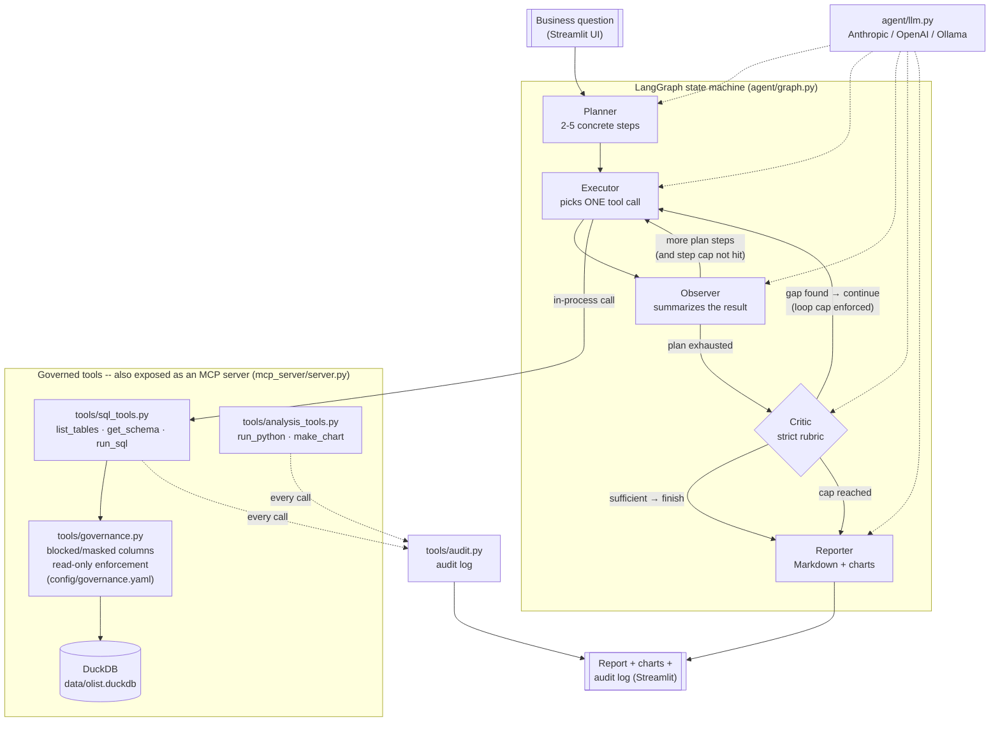

# 📊 Nova Analyst

**A governed, MCP-native autonomous data analyst agent** — ask a plain-English
business question, watch it plan a multi-step investigation, query a
warehouse through governed tools, self-critique its own findings, and get
back a narrated insight report with charts. Ships with a built-in Olist
e-commerce demo, but isn't limited to it — upload your own CSV(s) in the UI
and Nova Analyst will discover the schema, auto-suggest (and let you edit) a
governance policy for it, and analyze that instead. Built as a portfolio demo
aimed squarely at how NuoData thinks about agentic analytics: MCP-native
tools, an explicit governance layer, and a swappable LLM underneath.

---

## The problem, framed against NuoData

NuoData's platform pairs an agentic module (**Nora**) with an MCP tool
registry and a governance layer (**Halo**). The hard part of that story isn't
"can an LLM write SQL" — it's:

1. **Governance has to be enforced, not requested.** A system prompt that
   says "don't touch PII" is not a control; an LLM can be talked out of a
   system prompt. Nova Analyst enforces column-level policy in plain Python
   (`tools/governance.py`) *before* SQL ever reaches the warehouse — the
   agent literally cannot bypass it, and it has to reason honestly about the
   resulting gap in its final report.
2. **Tools have to be provider-agnostic infrastructure, not app code.** Nova
   Analyst's tools are exposed over MCP (`mcp_server/server.py`), so the same
   governed tool surface is callable by this project's own LangGraph agent,
   by Claude Desktop, or by a registry like Nora's — identically.
3. **The reasoning has to be visible and self-correcting.** Nova Analyst is
   an explicit LangGraph state machine, not a single opaque LLM call. Every
   plan, tool call, observation, and Critic verdict streams live in the UI,
   and a real self-correction loop (Critic catches a gap → Executor closes
   it) is demonstrable on screen, not just claimed in a slide.
4. **"Any LLM" has to actually be true.** One module (`agent/llm.py`) is the
   entire surface area for swapping providers — Anthropic today, OpenAI or a
   local Ollama model with a few added lines, nothing else in the codebase
   touches a provider SDK.

## Architecture



**Design note on the MCP path:** the LangGraph agent calls the tool
implementations in `tools/` directly (in-process) for latency and
reliability in this prototype. `mcp_server/server.py` wraps the *exact same*
tool functions and is independently verified to work end-to-end over the
real MCP stdio protocol (tool discovery + call round-trips) — any MCP client
(Claude Desktop, a registry like Nora) can drive Nova Analyst's governed
tools today without changing a line of `tools/`.

### The five nodes

| Node | Job |
|---|---|
| **Planner** | Decomposes the question into 2-5 concrete, sequential investigation steps. |
| **Executor** | Picks exactly one tool call to make progress on the current step (`get_schema`, `run_sql`, `run_python`, or `make_chart`). |
| **Observer** | Summarizes what the tool actually returned, in plain language — including saying plainly when a policy violation or error occurred. |
| **Critic** | Runs a strict rubric (coverage, contradictions, empty/error results, anomalies, governance handling, and — deterministically backstopped in code — whether a requested chart was actually produced) before the agent is allowed to finish. |
| **Reporter** | Writes the final Markdown report: Answer, Key Numbers, Method, Assumptions & Caveats — explicitly naming any governance restriction encountered. |

**Hard caps, always enforced:** max 6 tool-calling steps, max 2
Critic-triggered extra loops, ~1500 max output tokens per LLM call, and no
write/DDL SQL is ever possible (enforced independently in
`tools/governance.py`, not just by the prompt).

## Governance in the loop

`config/governance.yaml` declares the policy:

- **Blocked**: `customers.customer_unique_id` — a person-level identifier
  that could re-identify individuals across orders. Any query referencing it
  (directly, via `SELECT *`, or in a subquery) is rejected by
  `tools/governance.py` *before* it reaches DuckDB, with a structured
  `{"policy_violation": true, "reason": ...}` response.
- **Masked**: `reviews.review_comment_message` / `review_comment_title` —
  free-text fields that may contain PII. These can be selected (so
  `COUNT`/`EXISTS` still work) but values come back as `"[REDACTED]"`.
- **Read-only, always**: `sqlglot` parses every query; anything that isn't a
  `SELECT`/`WITH` (INSERT, UPDATE, DELETE, DROP, ALTER, ATTACH, ...) is
  rejected before execution.

The agent doesn't just get told this in a prompt — it discovers it via
`get_schema` (governed columns come back annotated `governance: blocked` /
`masked`, not silently hidden), hits it for real via `run_sql`, and the
Reporter is instructed to name the specific restriction and give an honest,
caveated partial answer rather than fabricate a number or quietly work
around it with a proxy column. Try the governance-demo example question in
the UI to see this live.

Every tool call — governed or not — is recorded by `tools/audit.py`
(input, output size, latency, whether a policy rule fired) and downloadable
as JSON from the UI.

## How to run

Requires Python 3.10+ (Python 3.11+ preferred if available) and an LLM API
key.

```bash
# 1. Install dependencies
make setup

# 2. Load data (tries the real Olist CSVs in data/raw/ first, falls back to
#    a synthetic dataset with the identical schema if they're not present --
#    so the app runs fully offline either way)
make data

# 3. Copy .env.example to .env and fill in your key (LLM_API_KEY, LLM_MODEL,
#    LLM_PROVIDER=anthropic|openai|ollama)
cp .env.example .env

# 4. Run the Streamlit app
make run
```

Other useful targets:

```bash
make test   # unit tests for tools/sql_tools.py and tools/governance.py
make mcp    # run the MCP server standalone (stdio transport)
make eval   # run the eval harness, writes evals/RESULTS.md
```

**No `make` on your machine (e.g. plain Windows without WSL/Git Bash `make`)?**
Every target is a one-liner -- run these directly instead:

```bash
python -m pip install -r requirements.txt   # make setup
python scripts/load_data.py                 # make data
python -m streamlit run app/streamlit_app.py  # make run
python -m pytest tests/ -v                  # make test
python mcp_server/server.py                 # make mcp
python evals/run_evals.py                   # make eval
```

### Using the real Olist dataset (optional)

By default `make data` generates a small synthetic dataset with the exact
same schema as Olist's Brazilian E-Commerce dataset, so the demo runs with
zero external dependencies. To use the real data instead: download it from
[Kaggle](https://www.kaggle.com/datasets/olistbr/brazilian-ecommerce), unzip
the CSVs into `data/raw/`, then re-run `python scripts/load_data.py`.

### Bring your own dataset

The Olist demo isn't the only dataset Nova Analyst can analyze. In the
sidebar, under **Data source → Upload your own CSV(s)**, you can upload any
CSV file(s) (one table per file):

1. Each file is loaded into a fresh DuckDB file (`data/uploads/`, gitignored)
   via `tools/dataset_loader.py` -- no schema setup required.
2. `tools/governance.py::suggest_policy_for_schema` scans the column names
   and auto-suggests a governance policy (name-pattern heuristics: emails,
   phone numbers, government/financial IDs, free-text fields, etc. get
   flagged `masked` or `blocked`; everything else is `open`).
3. You review and edit that suggestion in an editable table before
   confirming -- this becomes a real `GovernancePolicy` object
   (`tools/governance.py::build_policy_from_rules`), enforced by `run_sql`
   exactly like the built-in `config/governance.yaml` policy.
4. The agent then runs against your data: it calls `get_schema` to discover
   the real columns (no hardcoded Olist assumptions), and any column you
   marked governed behaves identically to the demo's `customer_unique_id` /
   `review_comment_message` examples.

This is a heuristic starting point, not real data classification -- review
the suggested policy before trusting it with anything sensitive.

## Eval results

Generated by `evals/run_evals.py` against 9 questions of increasing
difficulty (including two governance-edge-case questions — one hitting a
*blocked* column, one hitting a *masked* column). Scoring is simple,
rule-based, and documented honestly in the results file itself — see
[`evals/RESULTS.md`](evals/RESULTS.md) for the full table and methodology
note.

<!-- EVAL_SUMMARY_START -->
| Metric | Value |
|---|---|
| Task success rate | **8/9 (89%)** |
| Avg steps per question | 3.8 |
| Tool-error rate | 9.1% (3/33 calls) |
| Runs with a Critic-triggered self-correction | 44% |
| Total governance policy hits across all runs | 4 |

The one failure (`q5`, "show me a chart of monthly order volume over time")
is real LLM variance, not a bug: on that run the SQL step for the time
series didn't cleanly succeed before the loop budget ran out, so no chart
data was ever available to plot — the run still finished honestly with
`status: done` and a caveat in the report rather than crashing or
fabricating a chart. Re-running the same question typically succeeds (see
the live demo). Full per-question breakdown and the exact scoring logic:
[`evals/RESULTS.md`](evals/RESULTS.md).
<!-- EVAL_SUMMARY_END -->

## How this maps to NuoData's platform

| Nova Analyst | NuoData equivalent |
|---|---|
| `mcp_server/server.py` exposing `list_tables`/`get_schema`/`run_sql`/`run_python`/`make_chart` over MCP | An MCP registry entry — the same tools, discoverable and callable by any agent, not hand-wired into one app |
| `config/governance.yaml` + `tools/governance.py` enforcing blocked/masked columns in code | Halo — governance-in-the-loop, mechanically enforced rather than prompted |
| `agent/graph.py`'s explicit LangGraph state machine with a live-streamed trace | Nora — an agentic module whose reasoning is inspectable, not a black box |
| `agent/llm.py` as the single provider-swap point | "Any LLM" — the platform commitment that the reasoning engine underneath is not locked to one vendor |
| `tools/audit.py` + downloadable audit log | Governance's audit trail requirement — every tool call, every policy hit, timestamped and exportable |

## Demo links

- Hugging Face Spaces demo: _TODO — add link after deployment_
- 2-minute Loom walkthrough: _TODO — add link_

## Project structure

```
nova-analyst/
  data/                  # duckdb file + raw csvs (gitignored)
                          #   uploads/ -- per-session DuckDB files from uploaded CSVs (gitignored)
  scripts/load_data.py   # Olist loader with synthetic fallback
  config/
    semantic.yaml        # business terms -> tables/columns/certified metrics
    governance.yaml       # restricted/masked columns (PII) + policy rules
  tools/                 # tool implementations (pure python, unit-tested)
    sql_tools.py          # list_tables, get_schema, run_sql (read-only, sqlglot-validated)
    analysis_tools.py     # run_python (restricted pandas), make_chart
    governance.py         # enforces a GovernancePolicy; also suggests one for uploaded data
    dataset_loader.py      # loads uploaded CSVs into a fresh DuckDB file
    audit.py               # logs every tool call
  mcp_server/server.py   # wraps tools/ as an MCP server
  agent/
    llm.py                # swappable LLM client (reads env)
    graph.py              # LangGraph: Planner, Executor, Observer, Critic, Reporter
    state.py              # typed agent state + hard caps
    prompts.py             # node prompts, including the Critic's rubric
  app/streamlit_app.py   # UI: question in -> live step trace -> report -> audit download
  evals/
    questions.yaml        # 9 business questions, increasing difficulty
    run_evals.py           # scores task success, avg steps, tool-error rate, self-corrections
    RESULTS.md              # generated metrics table
  tests/                 # unit tests for sql_tools.py and governance.py
  README.md
  requirements.txt
  Makefile
  .env.example
```

## Notes on the stack

Built with Python 3.10 (available in the dev environment; 3.11+ is a drop-in
upgrade with no code changes needed), LangGraph, the official MCP Python SDK
(pinned `<2` — v2 renamed `FastMCP` to `MCPServer` and changed several APIs;
this project uses the widely-documented v1 `FastMCP` decorator pattern),
DuckDB, sqlglot for SQL parsing/validation, pandas + Plotly for
analysis/visualization, and Streamlit for the UI.
